# Graph Analysis using Apache Zeppelin

## Introduction

Graph analytics reveal information and provide knowledge which otherwise would remain hidden in your data. While there are many analytic tools that exist, Apache Zeppelin is recognized by many as the most versatile and favorite.

In this lab, you’ll learn how to use Apache Zeppelin for querying and visualization of Oracle Graphs.

Estimated Lab Time : 30 minutes

### About Zeppelin

Apache Zeppelin is web-based notebook-style application that enables interactive data analytics and collaboration using live code, text and visualizations. Like most notebooks, Zeppelin provides a number of useful data-discovery features such as :

- Easy data ingestion and loading
- Access to programming environments that help with data discovery and data analytics
- Out-of-the-box data visualizations
- Collaboration services for sharing notebooks

Zeppelin is essentially a scripting environment for running ordinary SQL statements along with a lot of other languages such as Spark, Python, Hive, R etc. These are controlled by a feature called "interpreters".

The in-memory analyst provides an interpreter implementation for Apache Zeppelin. This lab sets up a zeppelin notebook environment to connect to the in-memory analyst and runs queries to analyze the retail graph created earlier.

### Objectives

- Analyze the graph using Apache Zeppelin and the interpreter provided by the Graph server

### Prerequisites

- An Oracle Free Tier, Always Free, Paid or LiveLabs Cloud Account
- Successful completion of all steps in the previous lab

## **STEP 1**: Setup Zeppelin in a Docker Container

Running Apache Zeppelin on Docker is a great way to get started with Zeppelin. Follow the steps below to provision the Zeppelin docker container in the lab VM.

1. Logged in to the lab VM as **oracle**, change directory to **/home/oracle/oracle-pg**.

    ```
    <copy>cd /home/oracle/oracle-pg</copy>
    ```

2. The lab environment contains a Docker-compose YAML file (located in **/home/oracle/oracle-pg/docker-compose.yaml**) that defines the Zeppelin docker container configuration.

    - **Docker Compose** is a tool for defining and running multi-container Docker applications. With Compose, you use a YAML file to configure application’s services. Then, with a single command, create and start all the services from your configuration.

3. Build the Zeppelin container using **docker-compose**.

    ```
    <copy>sudo docker-compose up zeppelin</copy>
    ```

4. After a few minutes, observe the log from docker-compose. Ensure there are no errors in the output.

  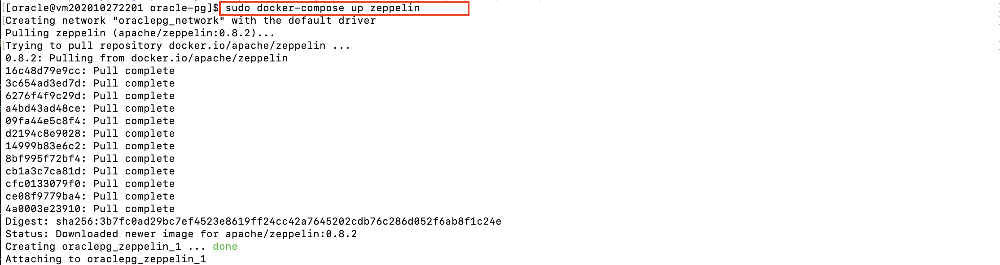
  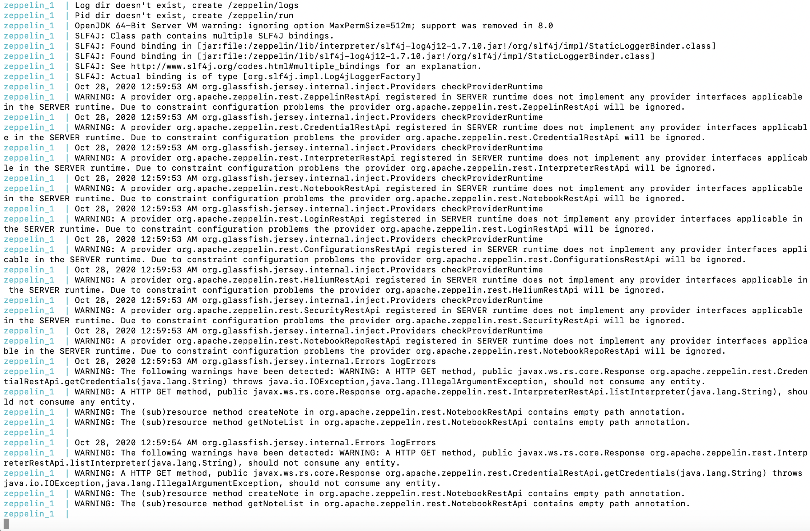

5. **DO NOT** exit this session.

## **STEP 2**: Login to Zeppelin

1. From your laptop/desktop, open a new web browser and point to the following URL for Apache Zeppelin, replacing the **{VM IP Address}** with your lab VM's IP Address.

    ```
    <copy>http://{VM IP Address}:8080</copy>
    ```

2. Upon a successful connection to Zeppelin you'll land at the main page similar to the below screenshot.

    - On the left of the page all existing notes are listed (**Notebooks** in Zeppelin are referred to as **Notes**). Notes consist of one or more paragraphs of code, which you can use to define and run snippets of code in a flexible manner.

    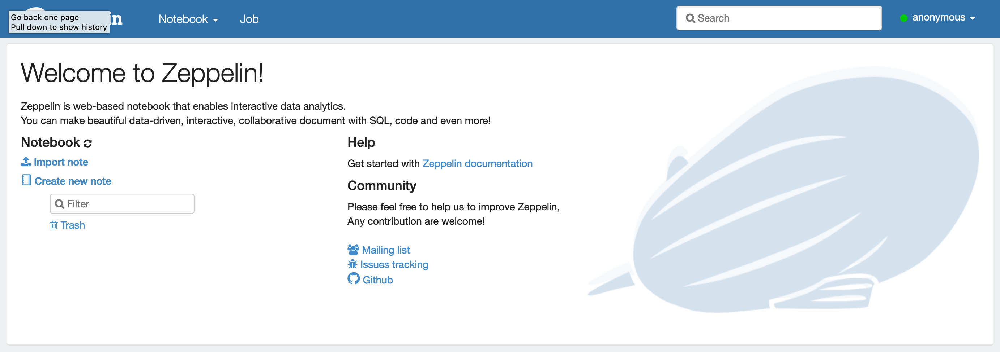

3. A pre-built Zeppelin Note has been provided to you for this lab. [Download] (https://objectstorage.us-phoenix-1.oraclecloud.com/n/oraclepartnersas/b/oracle_pg/o/zeppelin.json) the file (by **Right-Click** and **Save As**) and save it to your local machine.

4. Import the zeppelin.json note by clicking **Import Note**.

  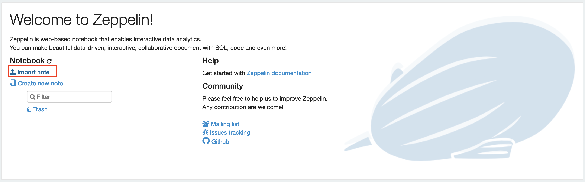

5. Zeppelin displays an import dialog giving you two options - import from local disk as a JSON file, or from a remote location using a URL. Click **Select JSON File**.

  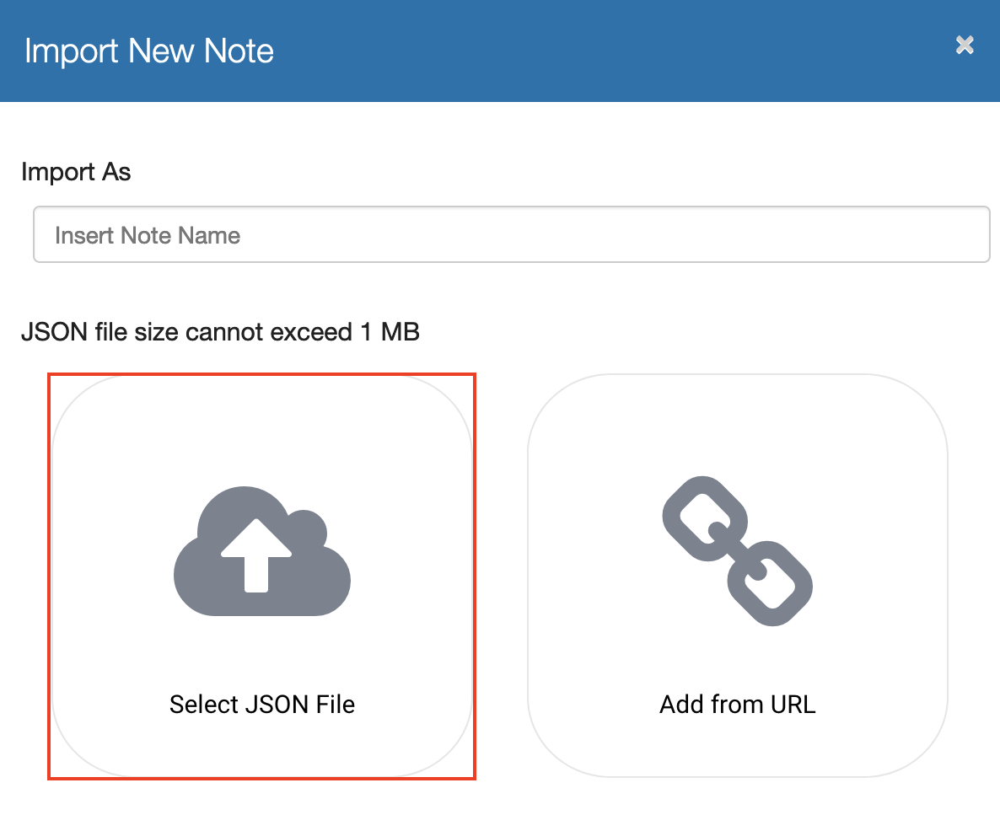

6. Locate the zeppelin.json file you've downloaded and click **Upload**.

    - By default, the name of the imported note is the same as the original note but you can override it by providing a new name.

    

## **STEP 3**: Connect to Graph Server

1. Click on **Online Retail** to open the note.

  

2. In the first section of the note titled **Connect to Graph Server**, replace **{VM\_IP\_Address}**, **{Retail\_Password}** and **{Keystore\_Password}** with your values.

  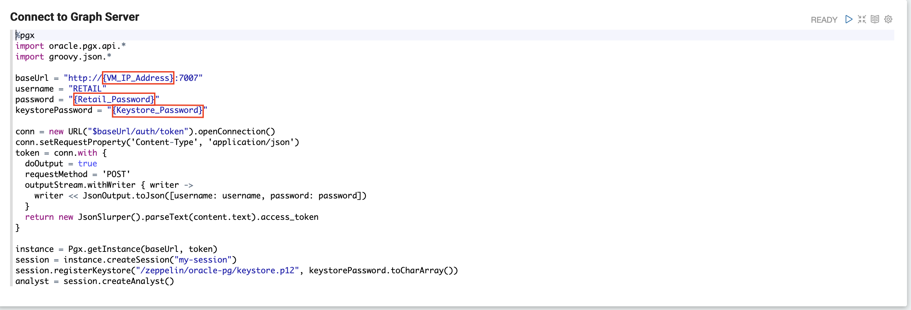

3. Click on **Run this Paragraph** on the top-right corner of **Connect to Graph Server** section, as shown in the screenshot.

  

4. Ensure the run is successful (status on top right of paragraph changes from **READY** to **FINISHED**) and you have successfully connected to the graph server.

  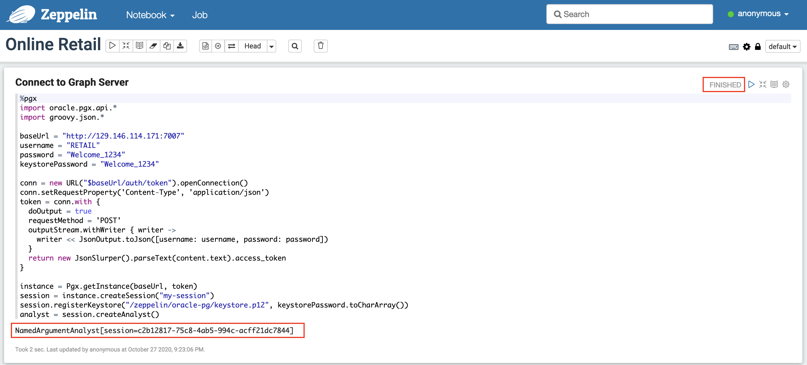

## **STEP 4**: Load Retail Graph

Load the retail graph using the **config-tables.json** file provided.

1. From the note, run the second paragraph titled **Get Graph on Graph Server** to load the graph by clicking **Run this Paragraph**. Verify the graph was successfully loaded, indicated by **FINISHED** status.

  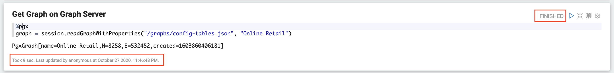

## **STEP 5**: Analyze Graph

Continue running the remaining paragraphs in the note.

1. Count the total number of nodes in the graph that represents **Products**.

  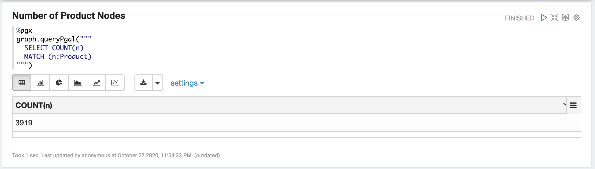

2. Count the total number of nodes representing **Customers**.

  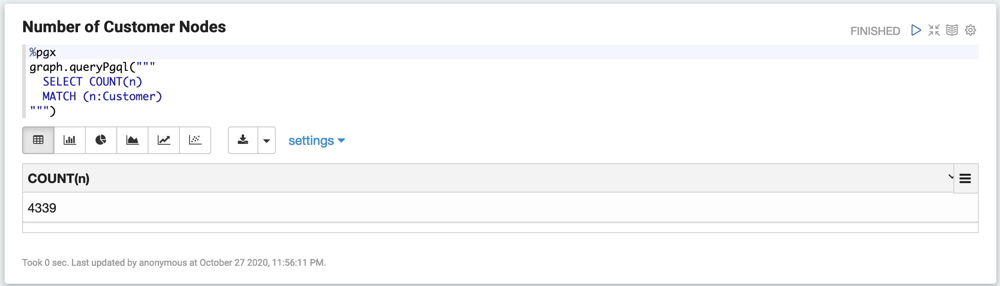

3. Count all graph edges indicating **Purchases**.

  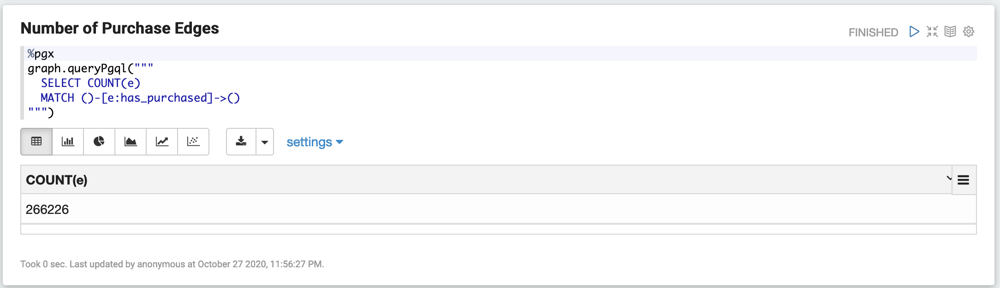

4. Count all reverse edges pointing to **customers who purchased products**.

  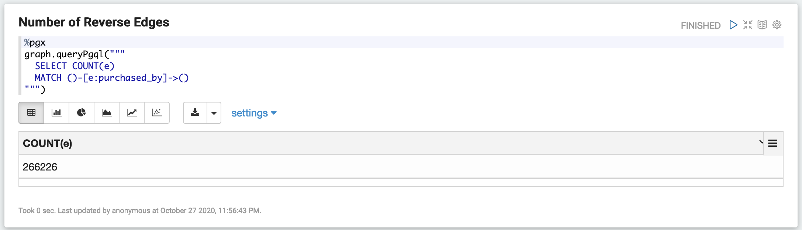

5. Get the top 10 customers with the **least number of purchases**.

  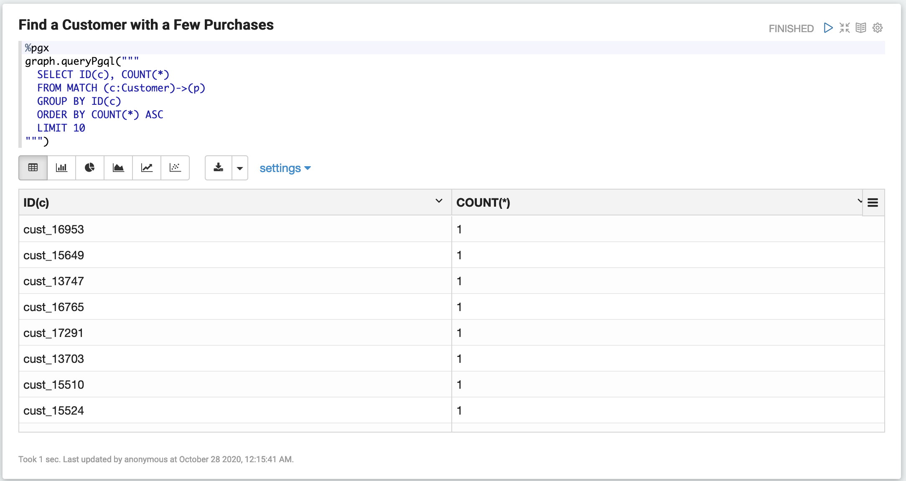

6. Get all **products purchased by a customer** ("cust\_12353").

  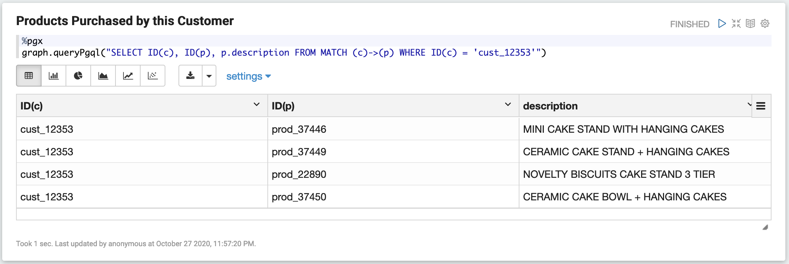

7. Calculate page ranks using **Personalized PageRank** algorithm.

  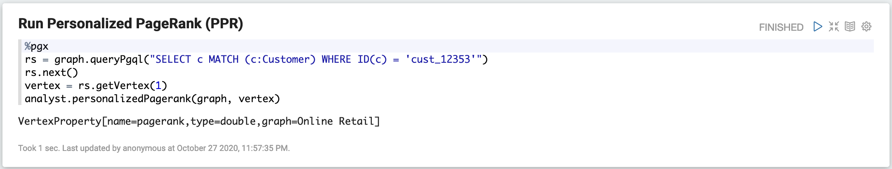

8. Get the **top 10 product recommendations for a customer** ("cust\_12353").

  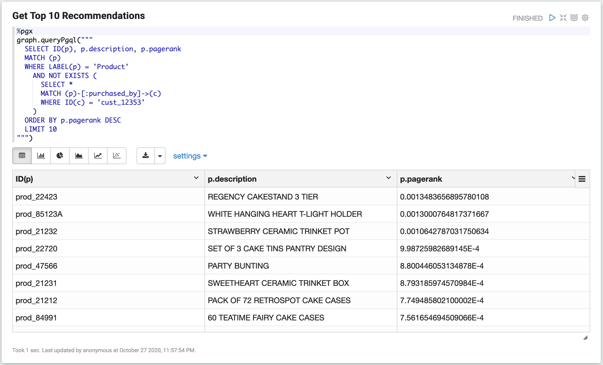

9. Get the **path to the recommended product** ("prod\_23166"), displaying intermediary nodes for a customer ("cust_12353"), including nodes and edges.

  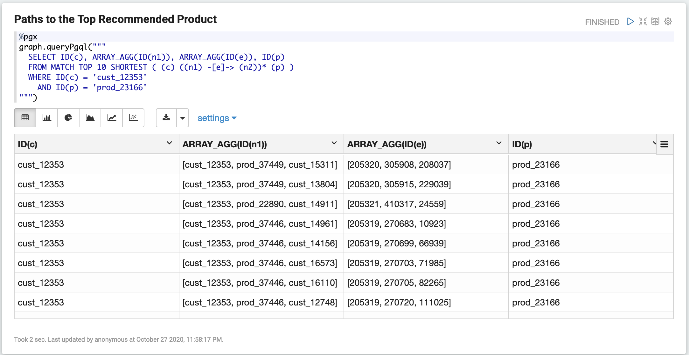

10. Count the **number of intermediary nodes** from the customer ("cust\_12353") to the recommended product ("prod\_23166").

  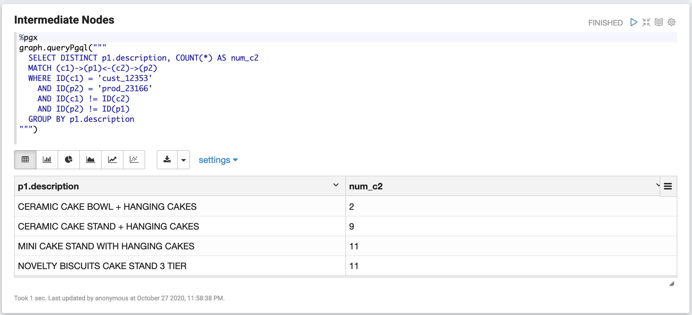

You have now successfully completed all labs in this workshop.

## Acknowledgements

- **Author** - Maqsood Alam, Product Manager, Oracle Database
- **Contributor** - Ryota Yamanaka, Product Manager, Oracle Spatial and Graph
* **Last Updated By/Date** - Maqsood Alam, Oct 2020

