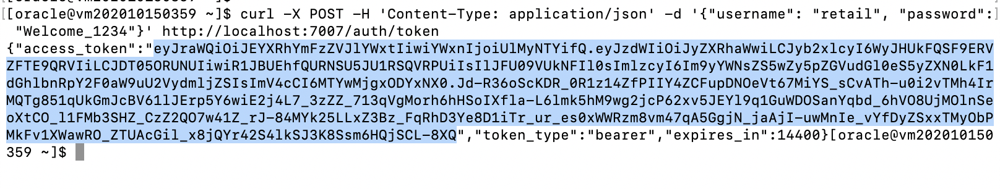
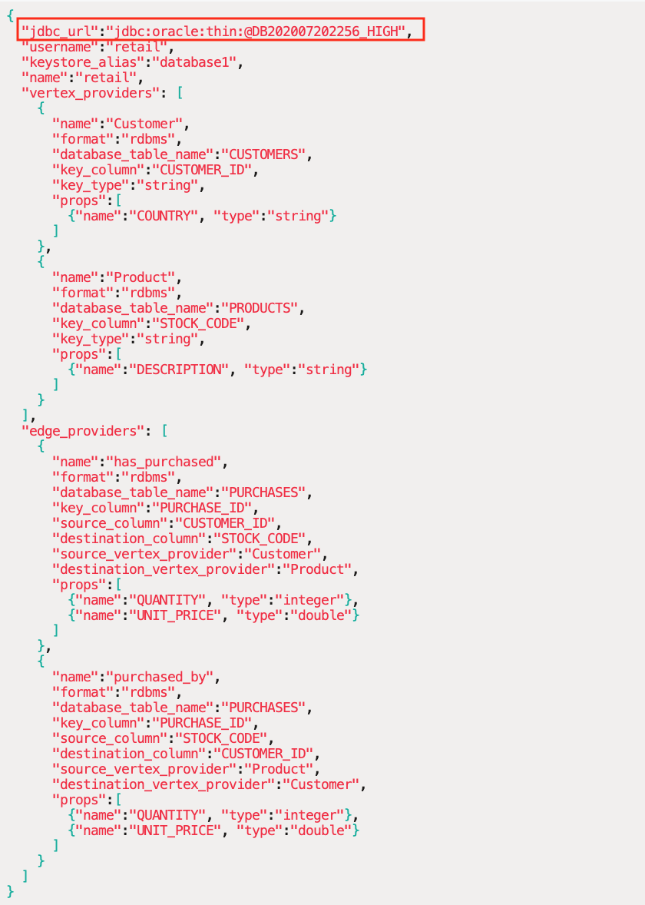
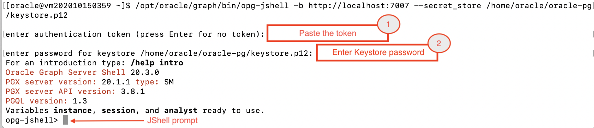
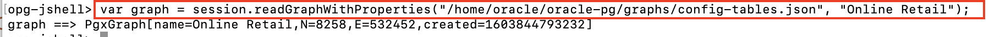
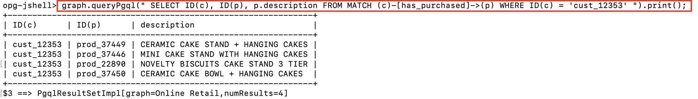

# Create Property Graph

## Introduction

As part of the Converged Oracle Database, a scalable property graph database along with a graph query language and developer APIs are provided. In this lab, you will create the property graph on the retail dataset to help demonstrate the power of graphs for analyzing relationships in data, in ways that relational queries possibly can’t.

Estimated Lab Time : 20 minutes

### About Property Graph

A property graph consists of a set of objects or vertices and a set of arrows or edges connecting the vertices. Vertices and edges can have multiple properties, which are represented as key-value pairs.

- Each **vertex** has a unique identifier and can have a set of outgoing edges; a set of incoming edges; and a collection of properties.
- Each **edge** has a unique identifier and can have an outgoing vertex; an incoming vertex; a text label that describes the relationship between the two vertices; and a collection of properties.

Depending on your needs, there are two different approaches to how you can create property graphs in Oracle Database.

* **Graph Database Use Case.** Store data as a property graph in Oracle Database and manage that data via graph APIs. Optionally, you may use in-memory graph server (**PGX**) as an accelerator for expensive queries or to run graph algorithms on the entire graph. Note that the use of PGX is optional in this use case. For some applications the capabilities available in the database only are sufficient.

* **Analytics-only Use Case.** Data is stored in relational form in the Oracle Database and you are not interested in a "graph database" but still want to benefit from the analytical capabilities of PGX, which exploit the connectivity of your data for specific analytical use cases. The Graph Server is capable of creating an in-memory property graph directly from the Oracle database, either from relational tables or Oracle Database Property Graph objects.

### Objectives

- Create the property graph using the Graph Server JShell client

### Prerequisites

- An Oracle Free Tier, Always Free, Paid or LiveLabs Cloud Account
- Successful completion of all steps in the previous lab

## **STEP 1**: Create an Authentication Token for Graph Server

1. Start a new SSH session using your private key **labkey**, **{VM IP Address}**, and **opc** user.

    ```
    <copy>ssh -i ~/oracle-pg/keys/labkey opc@{VM IP Address}</copy>
    ```

2. Switch current user to **oracle**.

    ```
    <copy>sudo su - oracle</copy>
    ```

3. Change directory to **/home/oracle/oracle-pg**.

    ```
    <copy>cd /home/oracle/oracle-pg</copy>
    ```

4. Generate and use a token for making authenticated remote requests to the graph server.

  Run the following command to sign in to the graph server and create the token, replacing **{RETAIL_PASSWORD}** with the password of the RETAIL schema :

    ```
    <copy>
    curl -X POST -H 'Content-Type: application/json' -d '{"username": "retail", "password": "{RETAIL_PASSWORD}"}' http://localhost:7007/auth/token
    </copy>
    ```

5. Copy the token as shown below and paste it in a text editor. You can now use this token to make authenticated remote requests to the graph server.

  

## **STEP 2** : Configure Graph Config JSON File

To define the graph configuration to load, you need a JSON file describing the location and properties of the graph. The file tells the Graph Server's in-memory analytics engine where to source the data from, the data definitions and the Keystore alias to use.

For example, when the source data is in relational format, the configuration file specifies a mapping from relational to graph format by using the concept of vertex and edge providers.

The following steps will modify a previously created config file for PGX to load **Oracle Retail** graph in memory, sourcing the data directly from relational tables in RETAIL schema.

1. Edit the **config-tables.json** file using your favorite text editor.

    ```
    <copy>nano ~/oracle-pg/graphs/config-tables.json</copy>
    ```

2. Replace the **{ADB Service Name HIGH}** in **"jdbc_url"** with your Autonomous Database service name, as follows :

    ```
    <copy>
    "jdbc_url": "jdbc:oracle:thin:@{ADB Service Name HIGH}"
    </copy>
    ```
    

3. **Save** the file and **Exit** the editor (in vi/vim, press **Esc**, type **:wq** and hit **ENTER**).

## **STEP 3**: Create a Property Graph using Graph Shell

1. Connect to Graph Server using Graph Shell (JShell) and the authentication token just created using an **opg-jshell** session.

    ```
    <copy>
    /opt/oracle/graph/bin/opg-jshell -b http://localhost:7007 --secret_store /home/oracle/oracle-pg/keystore.p12
    </copy>
    ```

2. You will be asked to enter the token created in the previous step. **Paste** the token that you have copied earlier.

3. Enter the Keystore password when prompted. Upon a successful login, you will get the **opg-jshell** prompt as follows :

  

4. Load the graph using the JSON file **/home/oracle/oracle-pg/config-tables.json**.

    ```
    <copy>
    var graph = session.readGraphWithProperties("/home/oracle/oracle-pg/graphs/config-tables.json", "Online Retail");
    </copy>
    ```
    

5. Test the graph by running a simple query that displays the list of products purchased by a customer.

    ```
    opg-jshell> <copy>graph.queryPgql(" SELECT ID(c), ID(p), p.description FROM MATCH (c)-[has_purchased]->(p) WHERE ID(c) = 'cust_12353' ").print();
    </copy>
    ```
    

6. **DO NOT CLOSE** the above graph shell session as you will need it in the next lab.

You may now [proceed to the next lab](#next).

## Acknowledgements

- **Author** - Maqsood Alam, Product Manager, Oracle Database
- **Contributor** - Ryota Yamanaka, Product Manager, Oracle Spatial and Graph
* **Last Updated By/Date** - Maqsood Alam, Oct 2020

