# Provision Lab Environment

## Introduction

The lab environment for this workshop will be hosted in Oracle Cloud Infrastructure. To minimize the provisioning steps and automate the process, you will execute a set of pre-built Terraform scripts from **Oracle Cloud Infrastructure (OCI) Cloud Shell**.

>[Terraform](https://www.terraform.io) is a tool that allows you to programmatically manage, version, and provision IT infrastructure using "infrastructure as code". Terraform uses a declarative syntax to describe resources within your infrastructure and then persist it in configuration files that can be shared, reviewed, edited, versioned, preserved, and reused.

>The [Oracle Cloud Infrastructure Terraform provider](https://www.terraform.io/docs/providers/oci/index.html) is a component that connects Terraform to Oracle Cloud resources that you want to manage.

Estimated Lab Time : 15 minutes

### Lab Environment

The lab environment for the workshop consists of :

* Oracle Cloud Infrastructure Compute Service (aka lab VM)
* Oracle Autonomous Database
* Oracle Graph Server and Client
* Apache Zeppelin and GraphViz for analysis and visualization

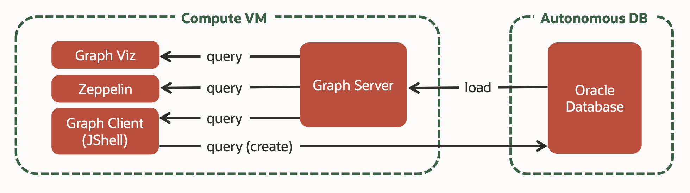

## **STEP 1** : Sign In to Oracle Cloud Infrastructure Console

Sign in to your **Cloud Account** from Oracle Cloud website. You will be prompted to enter the cloud tenant, user name, and password.

>If this is your first time signing in to Oracle Cloud Infrastructure, or for detailed sign in instructions, refer to [Getting Started with Oracle Cloud](https://docs.oracle.com/en/cloud/get-started/subscriptions-cloud/csgsg/sign-your-cloud-account.html).

## **STEP 2** : Start OCI Cloud Shell

**OCI Cloud Shell** is a web browser-based terminal accessible from the Oracle Cloud Console to all OCI users. It is free to use (within monthly tenancy limits), and provides access to a Linux shell, with a pre-authenticated OCI CLI, Terraform & Ansible installations, along with a few other useful tools (refer to [Cloud Shell](https://docs.cloud.oracle.com/en-us/iaas/Content/API/Concepts/cloudshellgettingstarted.htm)  documentation for details).

>To use the Cloud Shell, your tenancy administrator must grant the required IAM (Identity and Access Management) policy.

1. Start OCI Cloud Shell by clicking the **Cloud Shell** icon at the top right of Oracle Cloud Infrastructure console page. Cloud shell takes few seconds to initialize.

  
  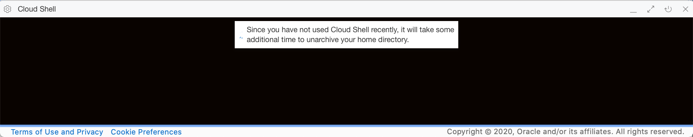

2. A Bash shell prompt will be presented after the session initializes.

  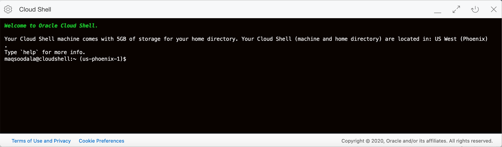

3. You may customize the cloud shell user interface (change font size, colors etc.) using the **Settings** icon, and maximize the terminal window using the **Maximize** icon.

  

## **STEP 3** : Create an SSH Key Pair

You will be utilizing Oracle Cloud Infrastructure Compute instance (aka lab VM) for installing the Oracle software required for this lab. OCI Compute instances use SSH keys instead of passwords to authenticate remote users and to encrypt the communications between network endpoints.

>The SSH (Secure Shell) protocol is a method to enable secure remote access and data transfers over insecure networks through Cryptography.
>
>An SSH key pair contains a private key and public key. You keep the private key on your computer and provide it every time you connect to the instance. The public key is kept on the compute instance.

1. Create a folder to store the lab environment SSH keys.

  ```
  <copy>mkdir -p ~/oracle-pg/keys
  cd ~/oracle-pg/keys</copy>
  ```

2. Using **ssh-keygen** create an OpenSSH PEM format key pair with the key file name **labkey**. Press **ENTER** twice for no passphrase.

  ```
  <copy>ssh-keygen -b 2048 -t rsa -f labkey</copy>
  ```
  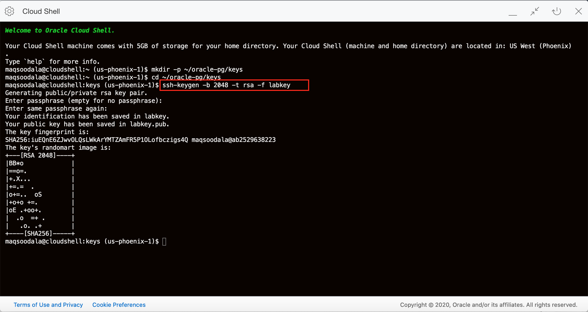

3. List the contents of **labkey** private key file.

  ```
  <copy>cat labkey</copy>
  ```
  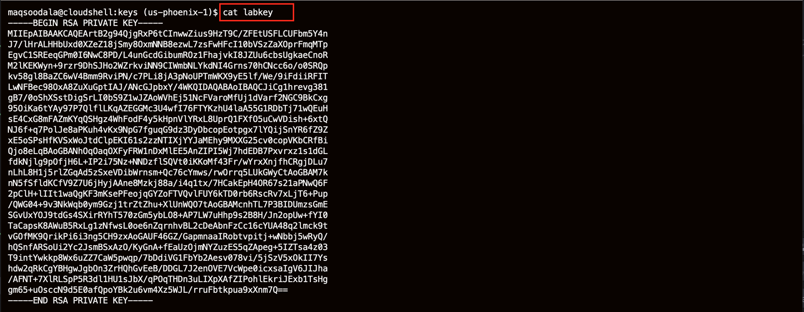

4. **IMPORTANT :** If you plan on using a different SSH client than **Cloud Shell** (e.g. PuTTY), copy the private key and (optionally) convert it to the destination tool's format. For example, PuTTY requires a PPK format which you can generate from the OpenSSH PEM key format using PuTTYgen. **Ensure the key remains intact during copy/paste.**

## **STEP 4** : Download Setup Scripts

A set of Terraform scripts have been pre-created to provision the lab environment. The scripts will create the following Oracle Cloud Infrastructure resources in your tenancy :

* Virtual Compute Network
* Compute Instance
* Oracle Autonomous Database
* Object Storage Bucket

>The lab environment gets provisioned using the **Free Tier** resources when they are available, and when not, they will be provisioned using paid resources. In both cases you need sufficient quota to create the above resources.

1. Create a folder to store the Terraform scripts.

  ```
  <copy>mkdir -p ~/oracle-pg/terraform
  cd ~/oracle-pg/terraform</copy>
  ```

2. Download the Terraform scripts using a Pre-Authenticated Request (PAR) URL as follows.

  ```
  <copy>wget https://objectstorage.us-phoenix-1.oraclecloud.com/p/0yyXbXi38Mmt8vBicaS1qlFmzlytWu4udUuE0IDTdUo/n/oraclepartnersas/b/oracle_pg/o/oracle-pg-tf-cs.tar.gz</copy>
  ```

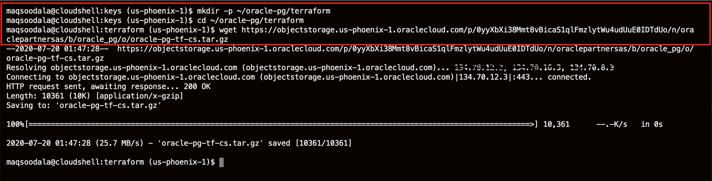

3. Uncompress the tar file using **tar**.

  ```
  <copy>tar xvzf oracle-pg-tf-cs.tar.gz</copy>
  ```

4. Check if **oracle-pg-tf-cs** folder gets created.

  ```
  <copy>ls</copy>
  ```

  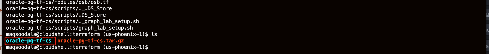

## **STEP 5** : Provision the Lab Environment

### Gather the Required Information

| Resource       | Value |
|----------------|-------|
|Cloud Region|Decide on a Cloud Region for the lab resources|
|Compartment OCID|Locate your [Compartment OCID](https://docs.cloud.oracle.com/en-us/iaas/Content/General/Concepts/identifiers.htm) (It is preferred to create a [New Compartment](https://docs.cloud.oracle.com/en-us/iaas/Content/GSG/Tasks/choosingcompartments.htm), but you may use an existing compartment as well)|
|ADB Admin Password | Password for the ADB ADMIN account (refer to [password rules](https://docs.oracle.com/en/cloud/paas/autonomous-data-warehouse-cloud/user/manage-users-admin.html#GUID-B227C664-EBA0-4B5E-B11C-A56B16567C1B))|

### Generate the Environment File Required for Terraform

For your convenience, a bash script has been provided to initialize the environment required for Terraform thereby saving you from manually entering the values at provisioning time. The bash script generates an environment file containing the initialized variables for Terraform.

Run the bash script as follows.

1. Change directory to **~/oracle-pg/terraform/oracle-pg-tf-cs** where the terraform scripts were extracted.

  ```
  <copy>cd ~/oracle-pg/terraform/oracle-pg-tf-cs</copy>
  ```

2. Generate the environment file using **generate_env.sh** script. The script will prompt for your **Cloud Region**, **Compartment OCID** and **ADB ADMIN Password**. The script checks the validity of your input against the available quota in your tenancy.

  ```
  <copy>./generate_env.sh</copy>
  ```
  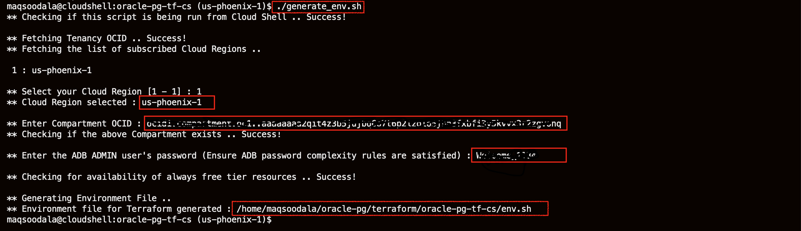

### Provision the Environment

1. Source the environment file in your current shell using the **source** command (or "**.**").

  ```
  <copy>source ./env.sh</copy>
  ```
  

2. Run **terraform init** to initialize the Terraform working directory. This is the first command that should be run after writing a new Terraform configuration or cloning an existing configuration.

  ```
  <copy>terraform init</copy>
  ```
  

3. Generate the execution plan for Terraform. The plan determines the necessary actions to create the desired cloud resources specified in the Terraform configuration.

  ```
  <copy>terraform plan</copy>
  ```
  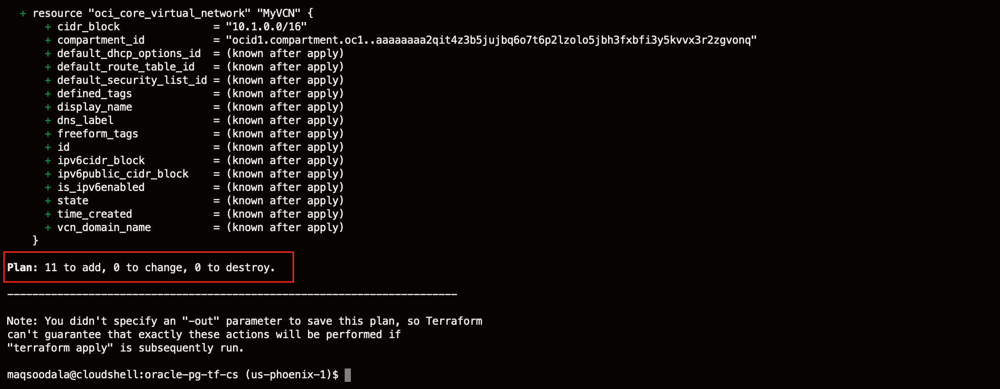

4. Finally, apply the Terraform configuration and create cloud resources using **terraform apply**. Terraform creates the resources and executes the actions defined by the Terraform configuration during the apply.

>Terraform apply will take a few minutes to complete. The time required to complete an apply job depends on the number and type of cloud resources to be created.

  ```
  <copy>terraform apply -auto-approve</copy>
  ```
  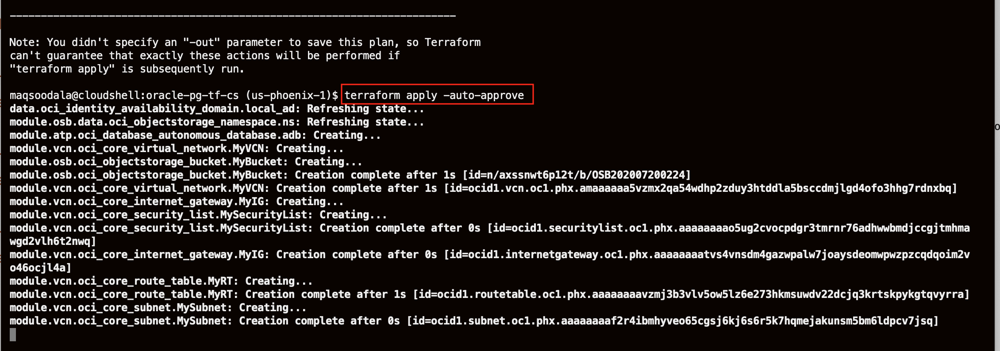

5. Upon a successful execution of Terraform apply, you will see the following values output on the screen.

  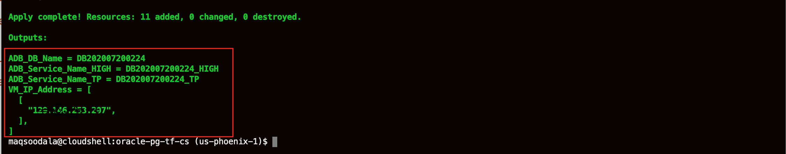

6. Please **Copy** the values in the highlighted section above and save them in a notepad. The labs will later refer to them (using the **Referred As** column).

| Value       | Referred As | Description
|----------------|-------------|----------------------|
|ADB DB name| {ADB DB Name} | Autonomous Database Name
|ADB Service Name HIGH|{ADB Service Name HIGH}|Database Service Name for ADW
|ADB Service Name TP|{ADB Service Name TP}|Database Service Name for TP
|VM IP Address|{VM IP Address}|IP Address of the OCI VM

## **STEP 6** : Validate Provisioning

### Log In to the Compute Instance

1. Using **Cloud Shell**, start an SSH session using your private key **labkey**, **{VM IP Address}**, and **opc** user.

>**Note:** Make sure that you replace the string, including the curly brackets {}, with the values obtained from Terraform apply.

  ```
  <copy>ssh -i ~/oracle-pg/keys/labkey opc@</copy>{VM IP Address}
  ```
  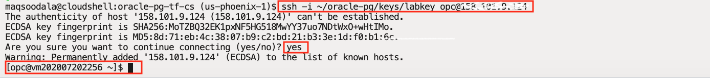

### Validate Connectivity to the Autonomous Database

The Autonomous Database provisioned for this lab will hold the sample data. Validate the connectivity to the autonomous database using the below steps.

2. In the SSH session, switch to user to **oracle**.

  ```
  <copy>sudo su - oracle</copy>
  ```
  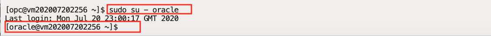

3. Log in to the autonomous database using **SQL Plus**. You will connect as the **ADMIN** user using **{ADB Admin Password}** and to **{ADB Service Name HIGH}** database service.

  ```
  <copy>sqlplus ADMIN/</copy>{ADB Admin Password}@{ADB Service Name HIGH}
  ```
  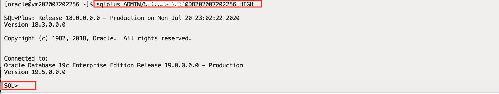

You may proceed to the next lab.

## Acknowledgements

- **Author** - Maqsood Alam, Product Manager, Oracle Database
- **Contributor** - Ryota Yamanaka, Product Manager, Oracle Spatial and Graph
* **Last Updated By/Date** - Maqsood Alam, Dec 2020

