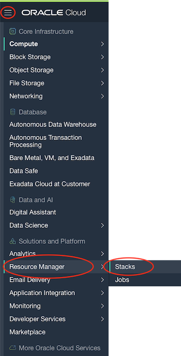
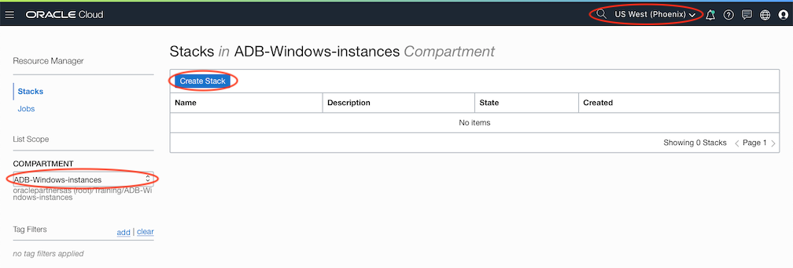
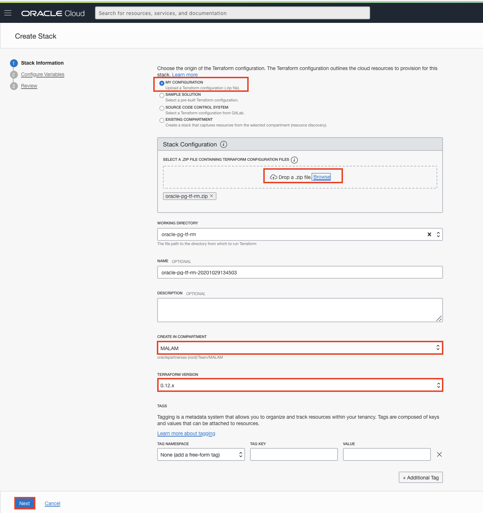
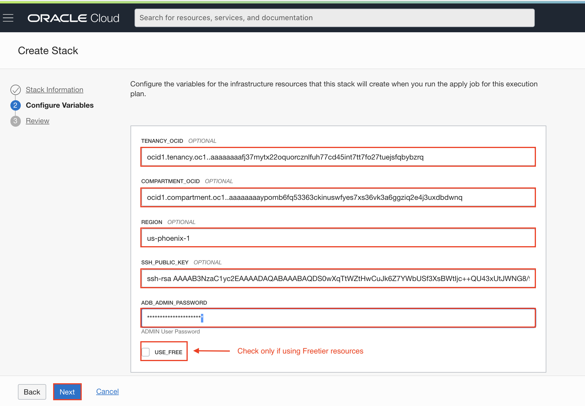
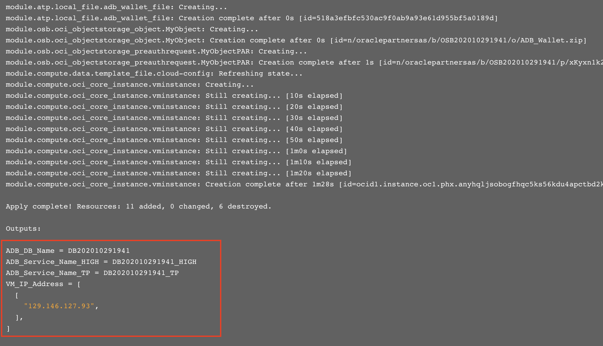

# Provision Lab Environment

## Introduction

The lab environment for this workshop will be hosted in Oracle Cloud Infrastructure. To minimize the provisioning steps and automate the process, you will use Oracle Cloud Infrastructure **Resource Manager**.

OCI [Resource Manager](https://docs.cloud.oracle.com/en-us/iaas/Content/ResourceManager/Concepts/resourcemanager.htm) is a managed service that can provision all Oracle Cloud Infrastructure resources and services. Resource Manager reduces configuration errors and increases productivity by managing infrastructure declaratively (i.e. "infrastructure as code") using industry standard Hashicorp Terraform®.

Estimated Lab Time : 15 mins

### Lab Environment

The lab environment for the workshop consists of :

* Oracle Cloud Infrastructure Compute Service (aka lab VM)
* Oracle Autonomous Database
* Oracle Graph Server and Client
* Apache Zeppelin and GraphViz for analysis and visualization

	

### Objectives

- Deploy the environment needed for the lab using OCI Resource Manager

### Prerequisites

- An Oracle Free Tier, Always Free, Paid or LiveLabs Cloud Account

## **STEP 1** : Sign In to Oracle Cloud Infrastructure Console

Sign in to your **Cloud Account** from Oracle Cloud website. You will be prompted to enter your cloud tenant, user name, and password.

If this is your first time signing in to Oracle Cloud Infrastructure, or for detailed sign in instructions, refer to [*Getting Started with Oracle Cloud*](https://docs.oracle.com/en/cloud/get-started/subscriptions-cloud/csgsg/sign-your-cloud-account.html).

## **STEP 2** : Create SSH Key Pair Using Cloud Shell

**Note:** Skip this step if you already have an SSH key pair you like to use.

The SSH (Secure Shell) protocol is a method to enable secure access and communication over insecure networks through cryptographically secured connections between endpoints.

Oracle Cloud Infrastructure compute instances uses an SSH key pair instead of a password to authenticate a remote user. A key pair file contains a private key and public key. You keep the private key on your computer and provide it every time you connect to the instance. The public key is kept on the compute instance.

In this step you will use **Oracle Cloud Shell** to create an SSH key pair.

For the purpose of this lab, Oracle Cloud Shell is the recommended interface for creating SSH keys as it does not require any local setup on your computer. However, you are free to choose any interface that you are familiar with for creating SSH keys (click [here](https://www.oracle.com/webfolder/technetwork/tutorials/obe/cloud/compute-iaas/generating_ssh_key/generate_ssh_key.html) for other methods for generating SSH Keys).

### Start the OCI Cloud Shell

**OCI Cloud Shell** is a web browser-based terminal accessible from the Oracle Cloud Console to all OCI users. It is free to use (within monthly tenancy limits), and provides access to a Linux shell, with a pre-authenticated OCI CLI, Terraform & Ansible installations, along with a few other useful tools (refer to [Cloud Shell](https://docs.cloud.oracle.com/en-us/iaas/Content/API/Concepts/cloudshellgettingstarted.htm)  documentation for details).

To use the Cloud Shell, your tenancy administrator must grant the required IAM (Identity and Access Management) policy.

1. Start OCI Cloud Shell by clicking the **Cloud Shell** icon at the top right of Oracle Cloud Infrastructure console page. Cloud shell takes few seconds to initialize.

	
	

2. A Bash shell prompt will be presented after the session initializes.

	

3. You may customize the cloud shell user interface (change font size, colors etc.) using the **Settings** icon, and maximize the terminal window using the **Maximize** icon.

	

### Create an SSH Key Pair

4. Create a folder to store the lab environment SSH keys.

	```
	<copy>mkdir -p ~/oracle-pg/keys
	cd ~/oracle-pg/keys</copy>
	```

5. Using **ssh-keygen** create an OpenSSH PEM format key pair with the key file name **labkey**. Press **ENTER** twice for no passphrase.

	```
	<copy>ssh-keygen -b 2048 -t rsa -f labkey</copy>
	```
	

6. List the contents of **labkey** private key file.

	```
	<copy>cat labkey</copy>
	```
	

7. **IMPORTANT :** If you plan on using a different SSH client than **Cloud Shell** (e.g. PuTTY), copy the private key and (optionally) convert it to the destination tool's format. For example, PuTTY requires a PPK format which you can generate from the OpenSSH PEM key format using PuTTYgen. **Ensure the key remains intact during copy/paste.**

## **STEP 3** : Provision Environment Using Resource Manager

**Resource Manager** removes the complexity and operational burden of deploying and managing infrastructure so you can focus on building great apps. With Resource Manager you can orchestrate most Oracle cloud resources using a point-and-click and easy-to-use interface.

The main component of resource manager is a **Stack**, which is a collection of Oracle Cloud Infrastructure resources corresponding to a given Terraform configuration. Each stack resides in the **Compartment** you specify, in a single **Region**. However, resources in a given stack can be deployed across multiple regions.

### Required Information for Resource Manager

| Resource       | Value |
|----------------|-------|
|Tenancy OCID    |Locate your [Tenancy OCID](https://docs.cloud.oracle.com/en-us/iaas/Content/General/Concepts/identifiers.htm)|
|Compartment OCID|Locate your [Compartment OCID](https://docs.cloud.oracle.com/en-us/iaas/Content/General/Concepts/identifiers.htm) (It is preferred to create a [New Compartment](https://docs.cloud.oracle.com/en-us/iaas/Content/GSG/Tasks/choosingcompartments.htm), but you may use an existing compartment as well)|
|Cloud Region Identifier | Retrieve the [Cloud Region Identifier](https://docs.cloud.oracle.com/en-us/iaas/Content/General/Concepts/regions.htm) of the Cloud region where you like the environment to be created|
|SSH Public Key   |SSH Public Key from the key pair created in the previous step|
|ADB Admin Password | Password for the ADMIN account (refer to [password rules](https://docs.oracle.com/en/cloud/paas/autonomous-data-warehouse-cloud/user/manage-users-admin.html#GUID-B227C664-EBA0-4B5E-B11C-A56B16567C1B))|
|Terraform configuration (.zip file)|[Download](https://objectstorage.us-phoenix-1.oraclecloud.com/n/oraclepartnersas/b/oracle_pg/o/oracle-pg-tf-rm.zip) the prebuilt Terraform script.|

### Create the Resource Manager Stack

Creating a **Stack** involves uploading the Terraform configuration file, providing identifying information for the new stack, and (optionally) setting the variables.

1. Open the **Navigation Menu** on the top-left. Under **Solutions and Platform**, locate **Resource Manager** and click **Stacks**.

	

2. Choose a **Compartment** that you have permission to work in (towards the left of the page), and ensure you are in the correct **Region** (towards the top of the page). Click **Create Stack**.

	

3. In the **Create Stack** dialog, enter the following :

	* Ensure **My Configuration** is selected.

	* In **Stack Configuration**, add the Terraform configuration file you've downloaded earlier (You may either drag and drop it onto the dialog box or click **Browse** and navigate to the file location).

	* Leave the **Working Directory** as default.

	* Enter a **Name** for the new stack (or accept the default name provided).

	* Optionally, enter a **Description**.

	* From the **Create in Compartment** drop-down, select the **Compartment** where you want to create the stack.
		- You may choose the same compartment as the lab environment for the Stack.

	* Select the **Terraform Version** as **0.12**.
		- **IMPORTANT:** The scripts require Terraform 0.12. Ensure you select the correct version as Terraform is not backwards compatible.

	* Optionally, you can apply tags.
		- Refer to the documentation section [**Tagging Overview**](https://docs.cloud.oracle.com/en-us/iaas/Content/Tagging/Concepts/taggingoverview.htm) for details on OCI Tagging.

	* Click **Next**.

	

4. On the **Configure Variables** screen, enter the values from **Required Information for Resource Manager** section. These values are required by the Terraform scripts for provisioning.

	**IMPORTANT :** Select **USE_FREE** if you are using Free Tier resources (ensure you have enough quota on Free Tier).

	Click **Next**.

	

5. In the **Review** panel, verify your stack configuration and click **Create** to create the Stack.

### Run the Plan Job

Running a plan job parses the Terraform configuration (.zip) file and converts it into an execution plan listing resources and actions that will result when an apply job is run. We recommend generating the execution plan before running an apply job.

6. On the **Stack Details** page, click on **Terraform Actions** -> **Plan**.

7. Review/update the plan job **Name** and click **Plan**.

8. The new plan job is listed under **Jobs**, with an initial state of **Accepted**. Soon the status changes to **In Progress**.

9. When the plan job is completed, the status will change to **Succeeded**.

10. Scroll to the bottom of the plan log and verify there are no errors, and the plan indicates the resources will be added.

### Run the Apply Job

When you run the apply job for a Stack, Terraform creates the resources and executes the actions defined in the Terraform configuration (.zip) file. The time required to complete an apply job depends on the number and type of cloud resources to be created.

11. Browse to the **Stack Details** page by clicking the link from the breadcrumbs.

	

12. Go to **Terraform Actions** and select **Apply**.

13. In the **Apply** dialog, review the apply job **Name** and ensure the **Apply Job Plan Resolution** is set to **Automatically Approve**.

	- You may optionally add **Tag** information. Refer to the documentation section [*Tagging Overview*](https://docs.cloud.oracle.com/en-us/iaas/Content/Tagging/Concepts/taggingoverview.htm) for details on OCI Tagging.

14. Click **Apply**.

15. The new apply job gets **Accepted** status.

16. The apply job status will quickly change to **In Progress**.

17. The job will take a few minutes to complete and will change status to **Succeeded** when successfully completed.

18. Verify the apply log by scrolling down to the **log** section and validate the resources were successfully created.

	

19. Please **Copy** the values in the highlighted section above and save them in a notepad. The labs will later refer to them (using the **Referred As** column).

	| Value       | Referred As | Description
	|----------------|-------------|----------------------|
	|ADB DB name| {ADB DB Name} | Autonomous Database Name
	|ADB Service Name HIGH|{ADB Service Name HIGH}|Database Service Name for DW workloads
	|ADB Service Name TP|{ADB Service Name TP}|Database Service Name for TP workloads
	|VM IP Address|{VM IP Address}|IP Address of the OCI VM

## **STEP 4** : Validate Provisioning

### Log In to the Compute Instance

1. Using **Cloud Shell**, start an SSH session using your private key **labkey** (or your own private SSH key that you may have used), **{VM IP Address}**, and **opc** user.

	```
	<copy>ssh -i ~/oracle-pg/keys/labkey opc@{VM IP Address}</copy>
	```
	

### Validate Connectivity to the Autonomous Database

The Autonomous Database provisioned for this lab will hold the sample data. Validate the connectivity to the autonomous database using the below steps.

2. In the SSH session, switch to user to **oracle**.

	```
	<copy>sudo su - oracle</copy>
	```
	

3. Log in to the autonomous database using **SQL Plus**. You will connect as the **ADMIN** user using **{ADB Admin Password}** and to **{ADB Service Name HIGH}** database service.

	```
	<copy>sqlplus ADMIN/{ADB Admin Password}@{ADB Service Name HIGH}</copy>
	```
	

You may now [proceed to the next lab](#next).

## Acknowledgements

- **Author** - Maqsood Alam, Product Manager, Oracle Database
- **Contributor** - Ryota Yamanaka, Product Manager, Oracle Spatial and Graph
* **Last Updated By/Date** - Maqsood Alam, Dec 2020

