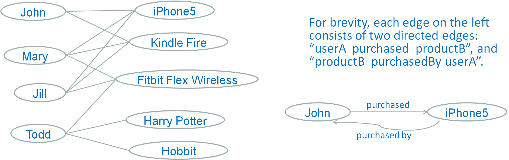
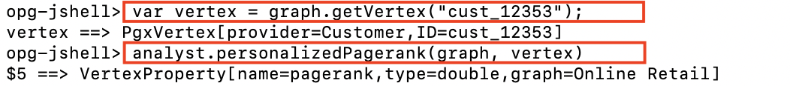
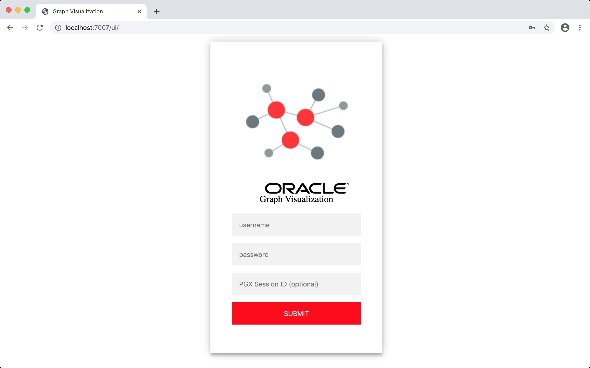
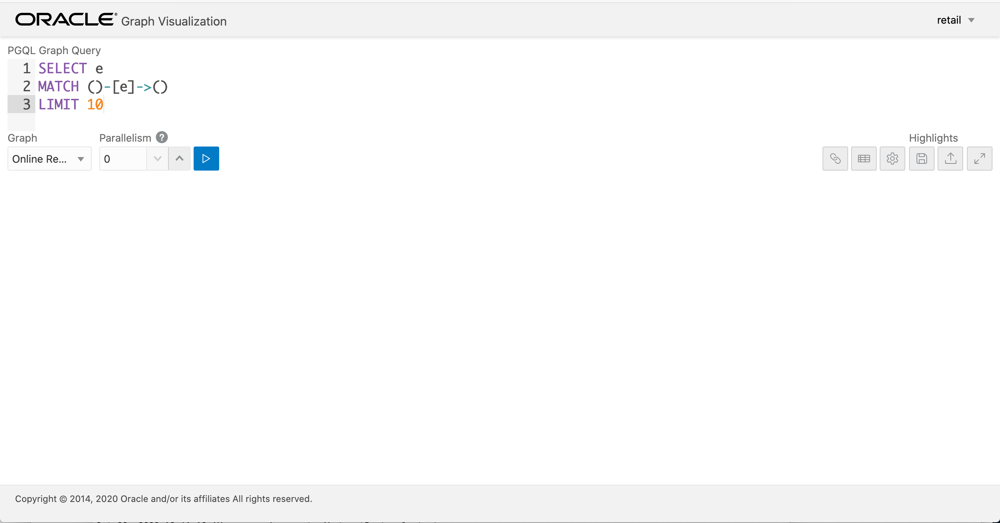
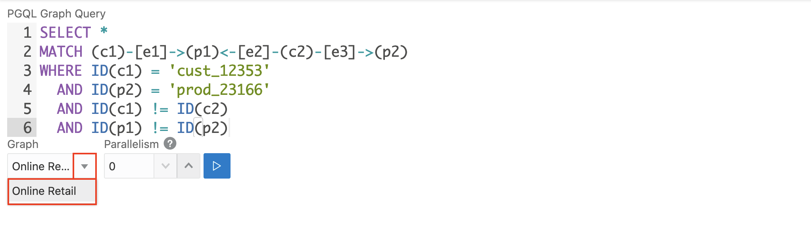
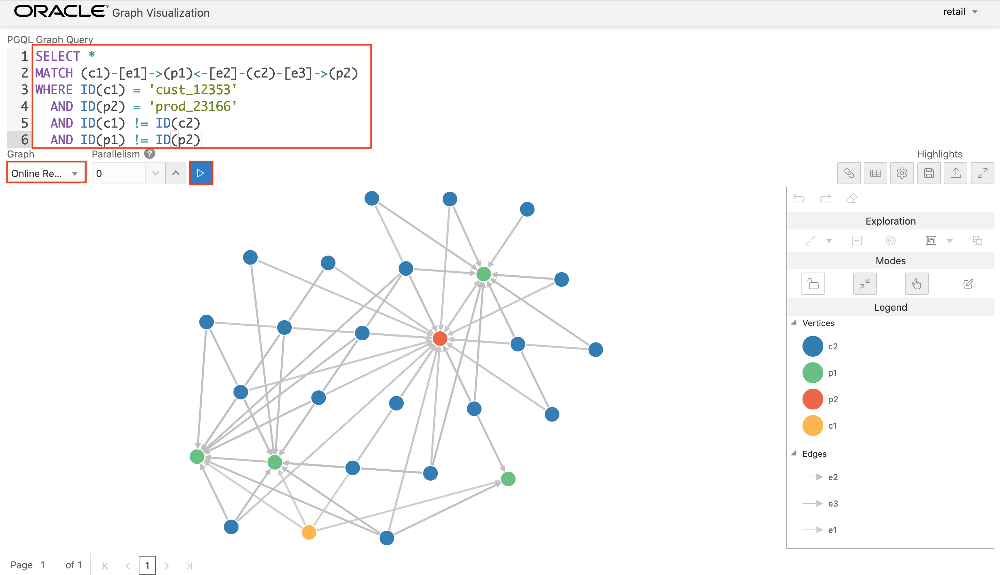
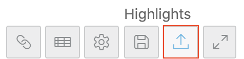
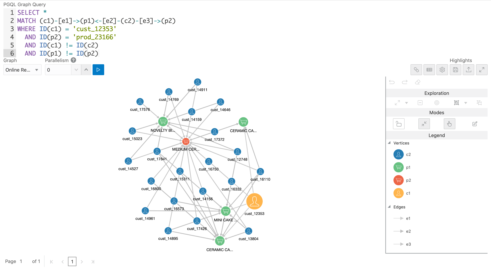

# Generate Recommendations and Visualize using GraphViz

## Introduction

Many algorithms exist to help data scientists in generating recommendations but the choice depends on the availability of data, technology platforms and business requirements.

In this lab you will generate recommendations directly on the dataset using a built-in algorithm of the Graph Server called Personalized PageRank. You will then use a visual interface called GraphViz to visualize the graphs and the recommendation results.

Estimated Lab Time : 15 minutes

### About GraphViz

**GraphViz** is a single-page web application that works with the in-memory graph analytics server. GraphViz takes PGQL queries as input and visually renders the results. This greatly benefits data exploration as rich visualizations can help reveal new insights which otherwise may not be visible.

GraphViz can visualize graphs that are have been loaded into the in-memory analytics server, either preloaded when the in-memory analytics server is started, or loaded at run-time by a client application.

### Objectives

- Run Pagerank algorithm on the retail dataset for Recommendations
- Analyze the results using the GraphViz client

### Prerequisites

- An Oracle Free Tier, Always Free, Paid or LiveLabs Cloud Account
- Successful completion of all steps in the previous lab

## **STEP 1**: Compute PageRank

Before attempting any visualizations with GraphViz, let's run a Page Rank algorithm to gather additional knowledge about the retail graph.

- As per **Wikipedia**: "PageRank (PR) is an algorithm used by Google Search to rank web pages in their search engine results. PageRank was named after Larry Page, one of the founders of Google. PageRank is a way of measuring the importance of website pages."

### Personalized PageRank for Recommendations

The **PageRank (PR)** algorithm starts from a random node in the graph and walks through the vertex to its neighboring node (when the nodes are connected) with a predefined probability p (also called **random walk**), or jumps to another vertex (when the nodes aren't connected) with probability 1-p. The algorithm will generate rankings (PR value) for vertices. A vertex with a high PR value is usually considered more "important" or more "influential" or having higher "relevance" than a vertex with a low PR value.

A **Personalized PageRank (PPR)** is a slight variation of the above where the jumps are back to one of a given set of starting vertices. In a way, the walk in PPR is biased towards (or personalized for) this set of starting vertices and is more localized compared to the random walk performed in PR.

The retail graph loaded in the previous session has data about customers purchasing products. The PPR algorithm will start at a customer (say John), and randomly walk to products purchased by John, and then other customers who purchased those products, and also products purchases by those customers, so on and so forth. In a way, this walk is able to reach users that are similar to John because they purchased the same (or similar, or related) products.

In addition, the walk in PPR discovers similar/related products because they were purchased by the same (or similar, or related) users. Here is a pictorial representation of this walk :

  

1. In the **opg-shell** session from the previous lab, run a Personalized PageRank (PPR) algorithm on the retail graph starting with customer **cust_12353** as a focused node.

    - The in-memory analyst contains a set of built-in algorithms that are available as Java APIs. The details of the APIs are documented in the Javadoc that is included in the product [documentation](https://docs.oracle.com/en/database/oracle/oracle-database/12.2/spgdg/using-inmemory-analyst-oracle-database.html#GUID-71FC3DB6-62F1-42E6-B711-A32958FC53D4) library.

    ```
    opg-jshell> <copy>var vertex = graph.getVertex("cust_12353");</copy>
    opg-jshell> <copy>analyst.personalizedPagerank(graph, vertex)
    </copy>
    ```
    

2. Now that we have page ranks computed, execute a PGQL query to get the top 10 recommended products for this customer **cust_12353**.

    ```
    opg-jshell> <copy>
    graph.queryPgql(
      "  SELECT ID(p), p.description, p.pagerank " +
      "  MATCH (p) " +
      "  WHERE LABEL(p) = 'Product' " +
      "    AND NOT EXISTS ( " +
      "     SELECT * " +
      "     MATCH (p)-[:purchased_by]->(a) " +
      "     WHERE ID(a) = 'cust_12353' " +
      "    ) " +
      "  ORDER BY p.pagerank DESC" +
      "  LIMIT 10"
      ).print();
      </copy>
      ```
      

3. From the results above, note the **Product ID** of the first row as that is the product with the highest rank to be recommended to this customer.

4. Get the current **PGX Session ID** as you will use it with GraphViz to connect to this session and have access to its state.

    ```
    opg-jshell> <copy>session.getId();
    </copy>
    ```
    

## **STEP 2**: Login to GraphViz

The Graph Server automatically runs graph visualization application on port 7007 in embedded mode.

  - GraphViz can be deployed in embedded mode or in Apache Tomcat or Oracle Weblogic Server. In this lab we will use the embedded mode of GraphViz.

1. From your laptop/desktop, open a new web browser and point to the following URL, replacing the **{VM IP Address}** with your lab VM's IP Address.

    ```
    <copy>http://{VM IP Address}:7007/ui</copy>
    ```

2. Login to GraphViz using the database credentials of the RETAIL user (remember we setup Graph to use Oracle database for authentication)

  Enter **RETAIL** as the username and **{Retail Password}**, along with the **PGX Session ID** copied earlier.

  

3. Upon a successful login you will be presented the following home page. The principal point of entry for the GraphViz application is the query editor, and also the graph list.

  

## **STEP 3**: Analyze the Graph

1. Copy/paste the PGQL query below to see the paths between the customer **cust\_12353** and the top recommended product shown earlier (**prod\_23166**).

    ```
    <copy>
    SELECT *
    MATCH (c1)-[e1]->(p1)<-[e2]-(c2)-[e3]->(p2)
    WHERE ID(c1) = 'cust_12353'
    AND ID(p2) = 'prod_23166'
    AND ID(c1) != ID(c2)
    AND ID(p1) != ID(p2)
    </copy>
    ```

2. Select the graph **Online Retail** from the drop-down. The graphs visible in the drop-down indicate they were successfully loaded at in PGX.

  

3. Run the query by clicking the **Run** button. Verify the Graph output.

  

## **STEP 4**: Add Highlights to the Graph

- The Highlights tab includes customization options that let you modify the appearance of edges and vertices. Highlighting can be applied based on conditions (filters) on single or multiple elements.

- You can export and import highlight options by clicking the **Save** and **Load** buttons in the main window. Save lets you persist the highlight options, and Load lets you apply previously saved highlight options.

1. [Download] (https://objectstorage.us-phoenix-1.oraclecloud.com/n/oraclepartnersas/b/oracle_pg/o/highlights.json) the highlights JSON file (by **Right-Click** and **Save As**) and save it to your local machine. The file contains the graph highlight definitions, mainly, adds icons and changes the size of icons according to personalized page ranks (PPR).

2. Import highlights.json by clicking **Import**.

  

3. After the highlights are imported, note the icons get added to the nodes and their size is changed according to their PPR.

  

You may now [proceed to the next lab](#next).

## Acknowledgements

- **Author** - Maqsood Alam, Product Manager, Oracle Database
- **Contributor** - Ryota Yamanaka, Product Manager, Oracle Spatial and Graph
* **Last Updated By/Date** - Maqsood Alam, Oct 2020

